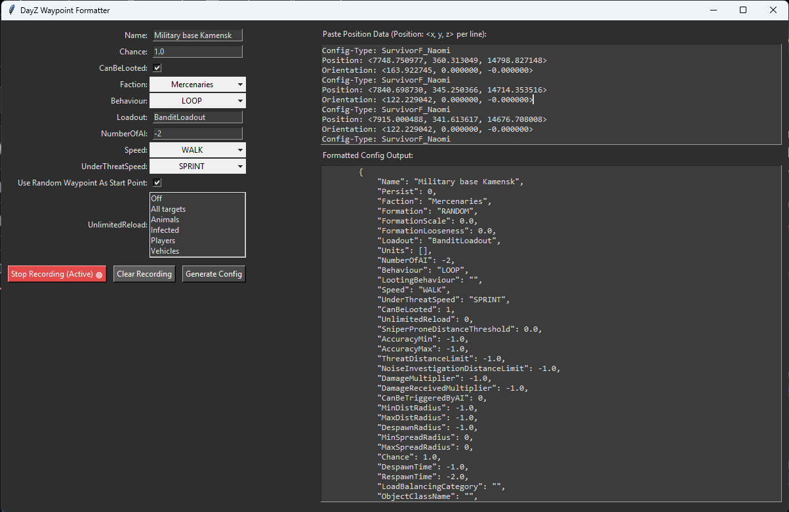

<h1 align="center">dayz-expansion-ai-waypoint-maker dayz-expansion-ai-waypoint-maker</h1>

[This tool requires VPPAdminTools](https://steamcommunity.com/sharedfiles/filedetails/?id=1828439124)

<h3 align="center">How to use</h3>

Simply start up your game and press Start recording

Tab back into your game and then press P to copy your current coordinates

You should now see the coordinates show up in the paste position data section

Simply configure what you want on the left and then click Generate Config

Then simply copy and paste the formatted config output into your AIPatrolSettings.json and Done!

This program was made in about 2h using chat GPT because I couldn't be bothered to make it myself. if it blows up your computer that's your problem not mine.
